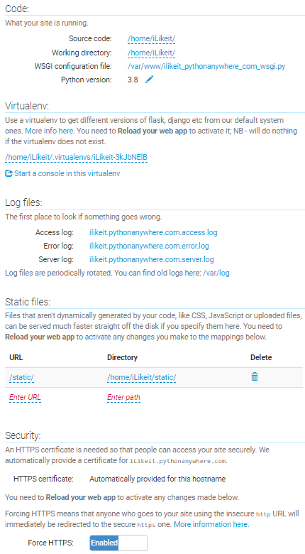
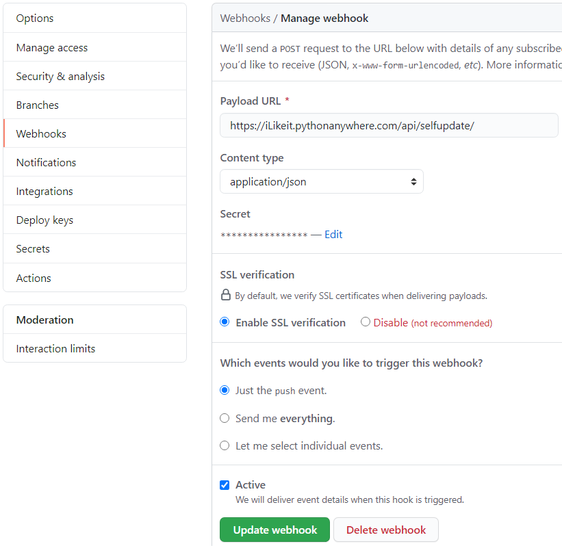

# Project deployment manual

> for pythonanywhere.com, last tested at 2020-09-23


## Prepare website files on the hosting

First, clone the git repo from github to the current working dir:  
``` bash  
# check the dir:
$ pwd && ls
# /home/iLikeit

# if the dir is empty:
git clone https://github.com/Ratgor/iLikeit-voting-platform .

# if the dir is not empty:
$ git init
# Initialized empty Git repository in /home/iLikeit/.git/
$ git remote add origin https://github.com/Ratgor/iLikeit-voting-platform
$ git pull origin master
```

Second, register a superuser for site administration (before database init):
``` bash
python3 manage.py createsuperuser # write down name email pass
```

Third, create a new database file (sqlite)
``` bash
$ python3 manage.py migrate
```


Next, make a virtual python environment,  
and save path to it for the further hosting settings:
``` bash
$ python3 -m pip install pipenv --user # "python" command linked to python2 for Linux OS needs
$ pipenv shell
# Launching subshell in virtual environment… . /home/iLikeit/.virtualenvs/iLikeit-3kJbNElB/bin/activate
$  . /home/iLikeit/.virtualenvs/iLikeit-3kJbNElB/bin/activate
```

Last, setup required python packages
``` bash
$ python3 -m pipenv install django djangorestframework django-cors-headers jsonfield gitpython dj-rest-auth[with_social] djangorestframework-simplejwt
```


## Site settings

First, for deploying an existing Django project, create a new pythonanywhere Web app with Manual Config:

src and work dir - as above (/home/iLikeit/),  
wsgi file - as below (next step),  
virtual env path - as above (I have asked to save it),  
static files - as in /backend/settings.py  
(url - /static/, dir - /home/iLikeit/static/),  
force HTTPS - enabled.

Like on the picture below:



Second, prepare pythonanywhere wsgi file  
to connect API for loading site files:

```
/var/www/ilikeit_pythonanywhere_com_wsgi.py
```

and the file s' content:
```
# +++++++++++ DJANGO +++++++++++
# To use your own django app use code like this:
import os
import sys

# assuming your django settings file is at '/home/iLikeit/backend/settings.py'
os.environ['DJANGO_SETTINGS_MODULE'] = 'backend.settings'

# and your manage.py is is at '/home/iLikeit/manage.py'
path = '/home/iLikeit'
if path not in sys.path:
    #sys.path.append(path) # default one
    sys.path.insert(0, path)

## Uncomment the lines below depending on your Django version
###### then, for Django >=1.5:
from django.core.wsgi import get_wsgi_application
application = get_wsgi_application()
###### or, for older Django <=1.4
#import django.core.handlers.wsgi
#application = django.core.handlers.wsgi.WSGIHandler()

```


## Site autoupdate

First, register new webhook at the github
(delivered webhooks also can be checked here):
https://github.com/Ratgor/iLikeit-voting-platform/settings/hooks/249189269

The webhook settings: on every git push event, https POST request, with application/json content, secret in headers, and SSL verification enabled, to payload url:  
https://iLikeit.pythonanywhere.com/api/selfupdate/

Like on the picture below:


Second, prepare (if no) python code for updating site src via git on webhook delivery event (see my selfupdate Django app in the site src).

Third, make new git post-merge file  
for site placement settings:

``` bash
$ .git/hooks/post-merge # make a file
$ chmod +x /home/iLikeit/.git/hooks/post-merge
```

and the file content:  
(touch to wsgi.py will update the file access time, that will cause server restart)

```
#!/bin/bash

# for test purposes:
python3 /home/iLikeit/manage.py migrate

touch /var/www/ilikeit_pythonanywhere_com_wsgi.py
```


## Redeploy on host side

If any git commits remove is required  
(after force-push git updates):

``` bash
$ git reset --hard HEAD^ # drop one last commit
$ git reset --hard HEAD~2 # drop two last commits
$ git pull origin master
```
btw.
``` bash
$ git rebase -i HEAD~2 # if I want to compress two last commits in one...
```


## Links

Some of that were used as guides for deploy:

[Official: Deploying Django at Pythonanywhere](https://help.pythonanywhere.com/pages/DeployExistingDjangoProject/)  
[Official forum: CSS not working - try to update static files](https://help.pythonanywhere.com/pages/DjangoAdminCSSNotWorking/)  
[Official: Setting up static files at Pythonanywhere (css, js, etc)](https://help.pythonanywhere.com/pages/DjangoStaticFiles)

[Connecting of github to pythonanywhere (rus)](https://habr.com/ru/post/457348/)  
[Connecting of github to pythonanywhere (eng)](https://medium.com/@aadibajpai/deploying-to-pythonanywhere-via-github-6f967956e664)

[django catch webhook 1](https://medium.com/@raiderrobert/how-to-make-a-webhook-receiver-in-django-1ce260f4efff)  
[django catch webhook 2](https://blog.bearer.sh/consume-webhooks-with-python/)  
[github webhook payload](https://developer.github.com/webhooks/event-payloads/)  
(github webhook payload best is available on github itself, see webhook settings page)

[celery tasks](https://docs.celeryproject.org/en/stable/django/first-steps-with-django.html)  
(currently not implemented, e.g. for webhooks postponed processing, like in first example mentioned above)


Unfortunately, lots of used moments were not mentioned here.  
Some of them just were integrated into the src files.
